# Industry Level Git Commands Practice

## 1. Git Configuration Commands

---

### 1. git config --global user.name

Syntax:
git config --global user.name "Your Name"

Purpose:
Sets the global username for Git commits.

Example:
git config --global user.name "iambhargav-2007"

Screenshot:
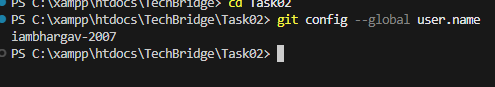

---

### 2. git config --global user.email

Syntax:
git config --global user.email "email@example.com"

Purpose:
Sets the global email for Git commits.

Example:
git config --global user.email "n220396@rguktn.ac.in"

Screenshot:
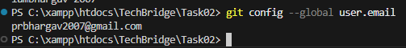

---

### 3. git config --list

Syntax:
git config --list

Purpose:
Displays all Git configuration settings including username, email, editor, and other configurations.

Example:
git config --list

Screenshot:
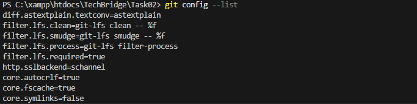

---

### 4. git config --unset

Syntax:
git config --unset <key>

Purpose:
Removes a configuration setting from Git.

Example:
git config --unset user.name

Screenshot:
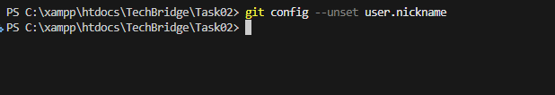

---

## 2. Repository Setup Commands

---

### git init

Syntax:
git init

Purpose:
Initializes a new Git repository in the current directory.

Example:
git init

Screenshot:
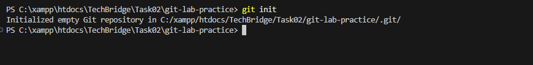

---

### git clone

Syntax:
git clone <repository-url>

Purpose:
Creates a copy of a remote repository on the local machine.

Example:
git clone https://github.com/bhargav-220396/WT-lab.git

Screenshot:
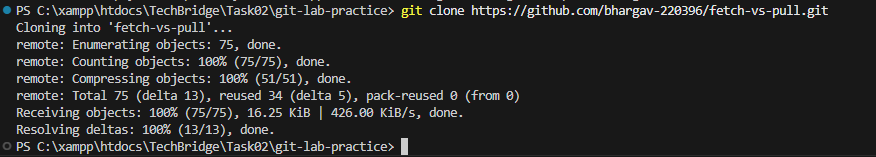

---

### git clone --branch

Syntax:
git clone --branch <branch-name> <repository-url>

Purpose:
Clones a specific branch from a repository.

Example:
git clone --branch main https://github.com/bhargav-220396/WT-lab.git

Screenshot:
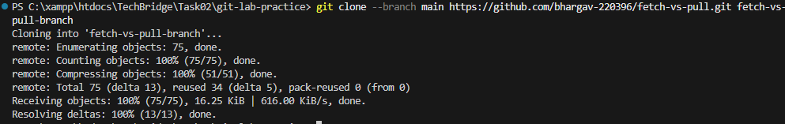

---

### git clone --depth

Syntax:
git clone --depth <depth> <repository-url>

Purpose:
Creates a shallow clone with limited commit history.

Example:
git clone --depth 1 https://github.com/bhargav-220396/WT-lab.git

Screenshot:
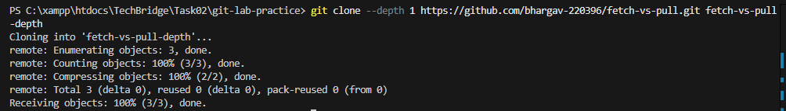

---

## 3. Repository Status & Inspection Commands

---

### git status

Syntax:
git status

Purpose:
Displays the current status of the working directory and staging area.

Example:
git status

Screenshot:
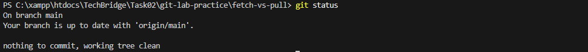

---

### git log

Syntax:
git log

Purpose:
Shows the commit history of the repository.

Example:
git log

Screenshot:
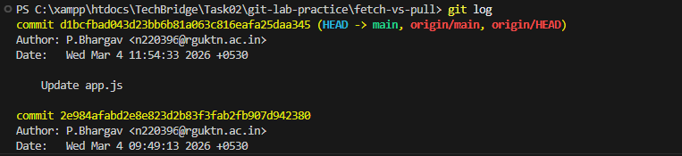

---

### git log --oneline

Syntax:
git log --oneline

Purpose:
Displays commit history in a compact one-line format.

Example:
git log --oneline

Screenshot:
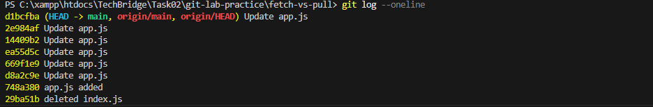

---

### git log --graph

Syntax:
git log --graph

Purpose:
Displays commit history as a graph showing branch structure.

Example:
git log --graph

Screenshot:
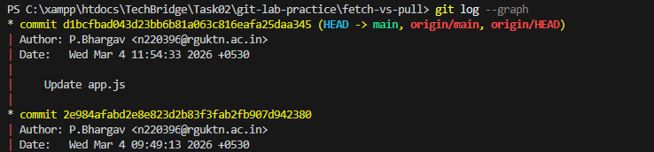

---

### git show

Syntax:
git show

Purpose:
Displays details of the latest commit including changes.

Example:
git show

Screenshot:
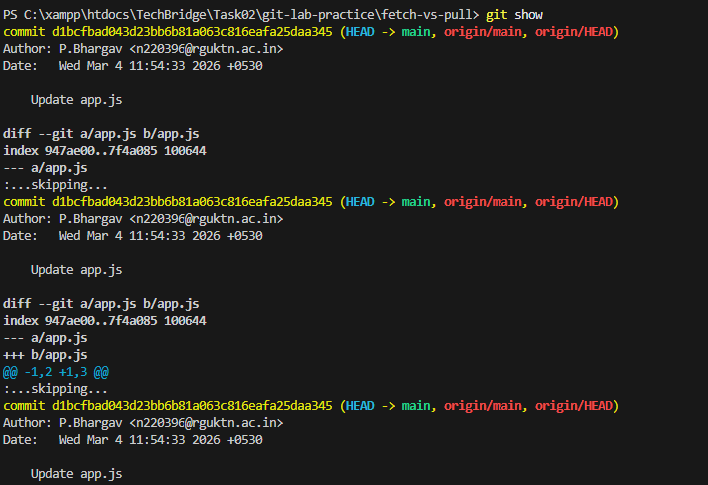

---

### git diff

Syntax:
git diff

Purpose:
Shows changes between working directory and last commit.

Example:
git diff

Screenshot:
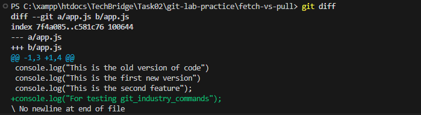

---

### git diff --staged

Syntax:
git diff --staged

Purpose:
Shows differences between staged changes and last commit.

Example:
git diff --staged

Screenshot:
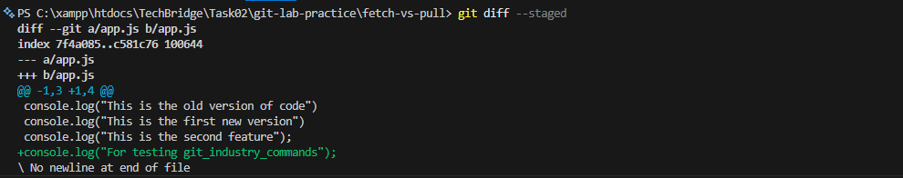

---

### git blame

Syntax:
git blame <file>

Purpose:
Shows line-by-line author information for a file.

Example:
git blame README.md

Screenshot:
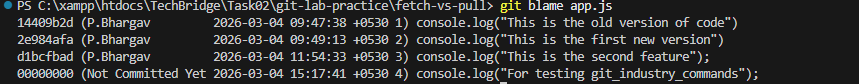

---

### git reflog

Syntax:
git reflog

Purpose:
Shows history of HEAD changes in the repository.

Example:
git reflog

Screenshot:
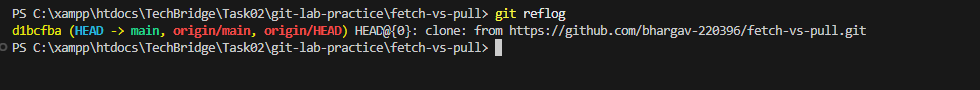

---

### git shortlog

Syntax:
git shortlog

Purpose:
Summarizes commit history by author.

Example:
git shortlog

Screenshot:
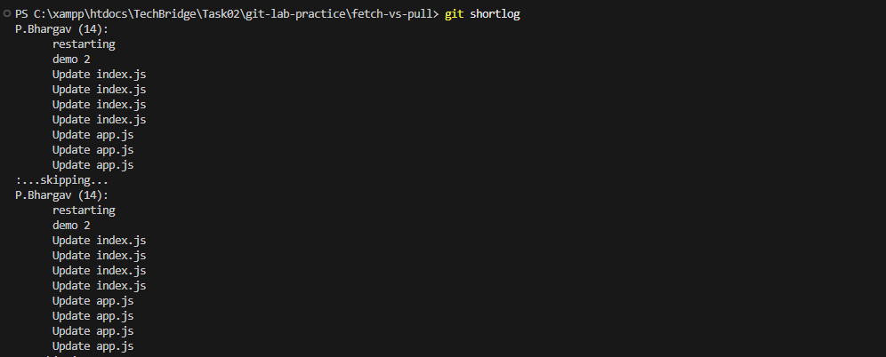

---

## 4. File Tracking Commands

---

### git add

Syntax:
git add <file>

Purpose:
Adds a file to the staging area.

Example:
git add tracking.txt

Screenshot:
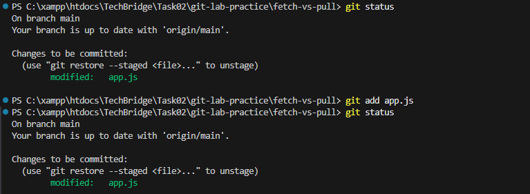

---

### git add .

Syntax:
git add .

Purpose:
Stages all modified and new files in the current directory.

Example:
git add .

Screenshot:
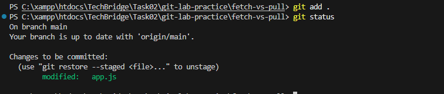

---

### git add -p

Syntax:
git add -p

Purpose:
Allows interactive staging of file changes.

Example:
git add -p

Screenshot:
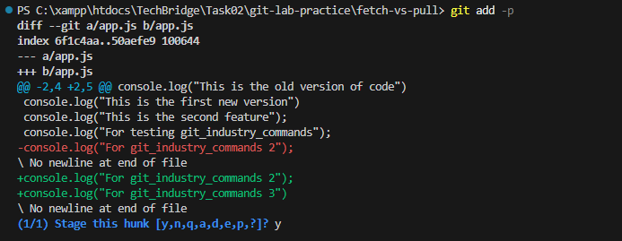

---

### git restore

Syntax:
git restore <file>

Purpose:
Restores a file to its previous committed state.

Example:
git restore tracking.txt

Screenshot:
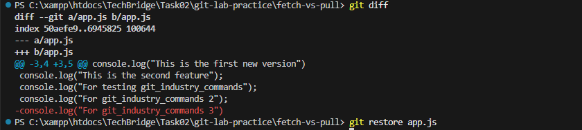

---

### git restore --staged

Syntax:
git restore --staged <file>

Purpose:
Removes a file from the staging area.

Example:
git restore --staged tracking.txt

Screenshot:
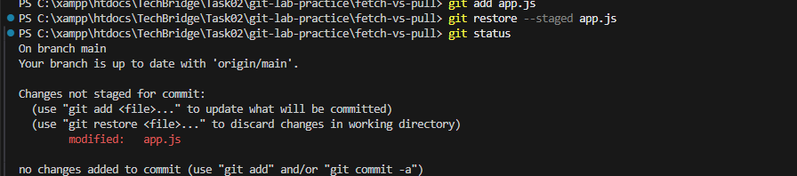

---

### git rm

Syntax:
git rm <file>

Purpose:
Removes a file from the repository and working directory.

Example:
git rm delete.txt

Screenshot:
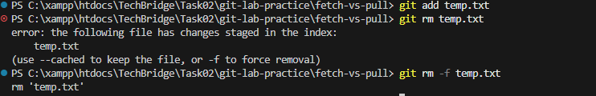

---

### git mv

Syntax:
git mv <old-file> <new-file>

Purpose:
Moves or renames a file in the repository.

Example:
git mv rename.txt renamed-file.txt

Screenshot:
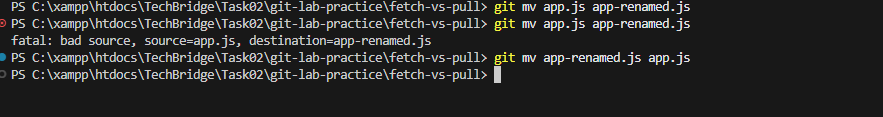

---

## 5. Commit Commands

---

### git commit

Syntax:
git commit

Purpose:
Creates a commit and opens an editor to write the commit message.

Example:
git commit

Screenshot:
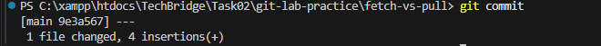

---

### git commit -m

Syntax:
git commit -m "message"

Purpose:
Creates a commit with a message directly from the command line.

Example:
git commit -m "Added new feature"

Screenshot:
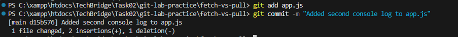

---

### git commit --amend

Syntax:
git commit --amend

Purpose:
Modifies the most recent commit.

Example:
git commit --amend

Screenshot:
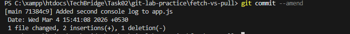

---

### git commit --no-edit

Syntax:
git commit --amend --no-edit

Purpose:
Amends the last commit without changing the commit message.

Example:
git commit --amend --no-edit

Screenshot:
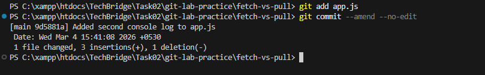

---

## 6. Branch Management Commands

---

### git branch

Syntax:
git branch

Purpose:
Lists all local branches.

Example:
git branch

Screenshot:
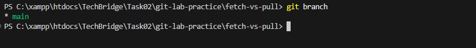

---

### git branch -a

Syntax:
git branch -a

Purpose:
Lists all local and remote branches.

Example:
git branch -a

Screenshot:
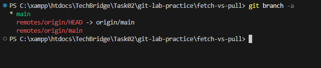

---

### git checkout -b

Syntax:
git checkout -b <branch-name>

Purpose:
Creates and switches to a new branch.

Example:
git checkout -b feature-test

Screenshot:
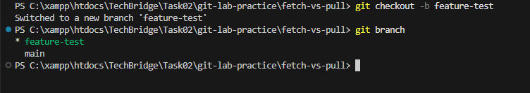

---

### git switch

Syntax:
git switch <branch-name>

Purpose:
Switches to another branch.

Example:
git switch main

Screenshot:
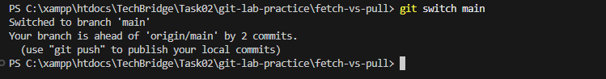

---

### git switch -c

Syntax:
git switch -c <branch-name>

Purpose:
Creates and switches to a new branch using switch command.

Example:
git switch -c bugfix-test

Screenshot:
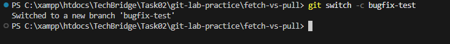

---

### git checkout

Syntax:
git checkout <branch-name>

Purpose:
Switches to another branch.

Example:
git checkout main

Screenshot:
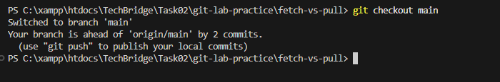

---

### git branch -d

Syntax:
git branch -d <branch-name>

Purpose:
Deletes a branch safely.

Example:
git branch -d feature-test

Screenshot:
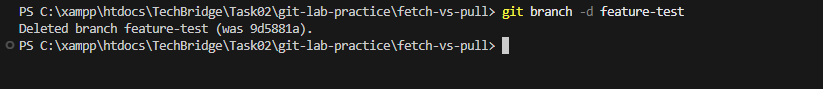

---

### git branch -D

Syntax:
git branch -D <branch-name>

Purpose:
Force deletes a branch.

Example:
git branch -D temp-branch

Screenshot:
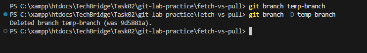

---

## 7. Merge & Integration Commands

---

### git merge

Syntax:
git merge <branch-name>

Purpose:
Combines changes from another branch into the current branch.

Example:
git merge merge-demo

Screenshot:
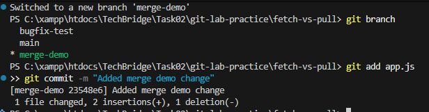

---

### git merge --no-ff

Syntax:
git merge --no-ff <branch-name>

Purpose:
Forces Git to create a merge commit even when fast-forward merge is possible.

Example:
git merge --no-ff merge-noff-demo

Screenshot:
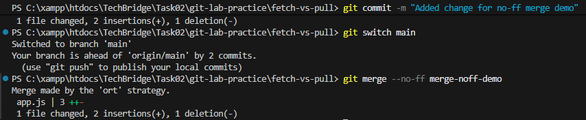

---

## 8. Remote Repository Commands

---

### git remote

Syntax:
git remote

Purpose:
Lists all configured remote repositories.

Example:
git remote

Screenshot:
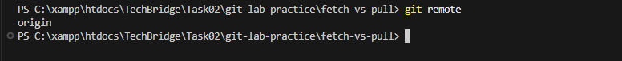

---

### git remote -v

Syntax:
git remote -v

Purpose:
Displays remote repository URLs along with their fetch and push operations.

Example:
git remote -v

Screenshot:
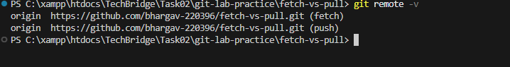

---

### git remote add

Syntax:
git remote add <name> <repository-url>

Purpose:
Adds a new remote repository to the local Git repository.

Example:
git remote add test-remote https://github.com/bhargav-220396/fetch-vs-pull.git

Screenshot:
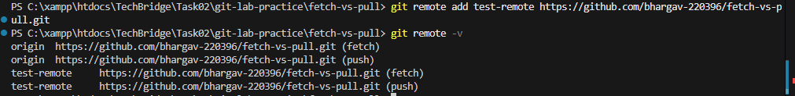

---

### git remote remove

Syntax:
git remote remove <name>

Purpose:
Removes a remote repository from the local configuration.

Example:
git remote remove test-remote

Screenshot:
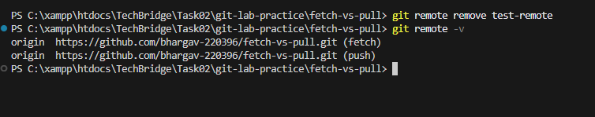

---

### git fetch

Syntax:
git fetch

Purpose:
Downloads commits, files, and references from a remote repository without merging them into the current branch.

Example:
git fetch

Screenshot:
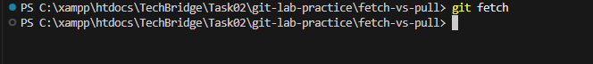

---

### git fetch --all

Syntax:
git fetch --all

Purpose:
Fetches updates from all configured remote repositories.

Example:
git fetch --all

Screenshot:

---

### git pull

Syntax:
git pull

Purpose:
Fetches changes from a remote repository and merges them into the current branch.

Example:
git pull

Screenshot:
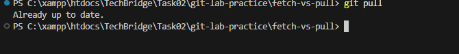

---

### git pull --rebase

Syntax:
git pull --rebase

Purpose:
Fetches remote changes and rebases local commits on top of them instead of merging.

Example:
git pull --rebase

Screenshot:
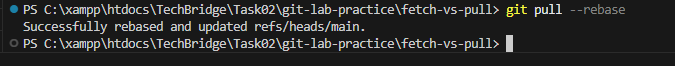

---

### git push

Syntax:
git push

Purpose:
Uploads local commits to the remote repository.

Example:
git push

Screenshot:
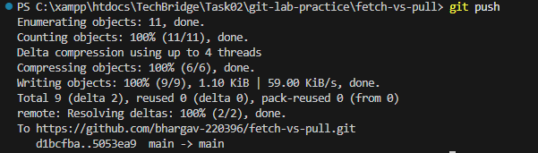

---

### git push -u origin branch-name

Syntax:
git push -u origin <branch-name>

Purpose:
Pushes a branch to the remote repository and sets it as the upstream branch.

Example:
git push -u origin remote-demo

Screenshot:
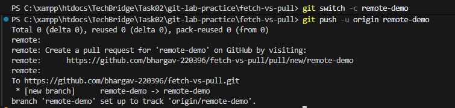

---

### git push --force

Syntax:
git push --force

Purpose:
Forces Git to overwrite the remote branch with local changes.

Example:
git push --force

Screenshot:
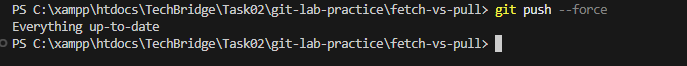

---

## 9. Stash Commands

---

### git stash

Syntax:
git stash

Purpose:
Temporarily saves changes in the working directory without committing them.

Example:
git stash

Screenshot:
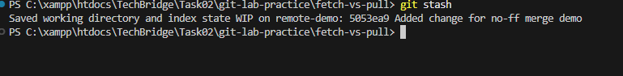

---

### git stash list

Syntax:
git stash list

Purpose:
Displays the list of all stashed changes.

Example:
git stash list

Screenshot:

---

### git stash pop

Syntax:
git stash pop

Purpose:
Applies the most recent stash and removes it from the stash list.

Example:
git stash pop

Screenshot:

---

### git stash apply

Syntax:
git stash apply

Purpose:
Applies the stashed changes without removing them from the stash list.

Example:
git stash apply

Screenshot:

---

### git stash drop

Syntax:
git stash drop stash@{0}

Purpose:
Deletes a specific stash entry.

Example:
git stash drop stash@{0}

Screenshot:

---

### git stash clear

Syntax:
git stash clear

Purpose:
Removes all stashed entries.

Example:
git stash clear

Screenshot:

---

## 10. Reset & Undo Commands

---

### git reset

Syntax:
git reset HEAD~1

Purpose:
Moves HEAD to a previous commit while keeping changes in the working directory.

Example:
git reset HEAD~1

Screenshot:

---

### git reset --soft

Syntax:
git reset --soft HEAD~1

Purpose:
Removes the last commit but keeps changes staged.

Example:
git reset --soft HEAD~1

Screenshot:

---

### git reset --mixed

Syntax:
git reset --mixed HEAD~1

Purpose:
Removes the last commit and unstages the changes.

Example:
git reset --mixed HEAD~1

Screenshot:

---

### git reset --hard

Syntax:
git reset --hard HEAD~1

Purpose:
Removes the last commit and deletes all associated changes permanently.

Example:
git reset --hard HEAD~1

Screenshot:

---

### git revert

Syntax:
git revert <commit-id>

Purpose:
Creates a new commit that reverses the changes of a previous commit.

Example:
git revert a1b2c3d

Screenshot:

---

### git clean -f

Syntax:
git clean -f

Purpose:
Removes untracked files from the working directory.

Example:
git clean -f

Screenshot:

---

### git clean -fd

Syntax:
git clean -fd

Purpose:
Removes untracked files and directories.

Example:
git clean -fd

Screenshot:

---

## 11. Rebasing Commands

---

### git rebase

Syntax:
git rebase <branch-name>

Purpose:
Moves or reapplies commits from the current branch onto another branch.

Example:
git rebase main

Screenshot:

---

### git rebase -i

Syntax:
git rebase -i HEAD~2

Purpose:
Performs an interactive rebase allowing editing, reordering, or squashing commits.

Example:
git rebase -i HEAD~2

Screenshot:

---

### git rebase --continue

Syntax:
git rebase --continue

Purpose:
Continues the rebase process after resolving conflicts.

Example:
git rebase --continue

Screenshot:

---

### git rebase --abort

Syntax:
git rebase --abort

Purpose:
Cancels the rebase process and returns the branch to its previous state.

Example:
git rebase --abort

Screenshot:

---

## 12. Cherry Pick & Patch Commands

---

### git cherry-pick

Syntax:
git cherry-pick <commit-id>

Purpose:
Applies a specific commit from another branch to the current branch.

Example:
git cherry-pick 37aeaf8

Screenshot:

---

### git format-patch

Syntax:
git format-patch -1

Purpose:
Creates a patch file from commits.

Example:
git format-patch -1

Screenshot:

---

### git apply

Syntax:
git apply <patch-file>

Purpose:
Applies changes from a patch file to the working directory.

Example:
git apply 0001-example.patch

Screenshot:

---

### git am

Syntax:
git am <patch-file>

Purpose:
Applies a patch and creates a commit automatically.

Example:
git am 0001-example.patch

Screenshot:

---

## 13. Tagging Commands

---

### git tag

Syntax:
git tag

Purpose:
Lists all tags in the repository.

Example:
git tag

Screenshot:

---

### git tag -a

Syntax:
git tag -a <tag-name> -m "message"

Purpose:
Creates an annotated tag for a specific commit.

Example:
git tag -a v1.0 -m "Version 1.0 release"

Screenshot:

---

### git tag -d

Syntax:
git tag -d <tag-name>

Purpose:
Deletes a tag from the local repository.

Example:
git tag -d v1.0

Screenshot:

---

### git push origin --tags

Syntax:
git push origin --tags

Purpose:
Pushes all tags to the remote repository.

Example:
git push origin --tags

Screenshot:

---

## 14. Submodule Commands

---

### git submodule add

Syntax:
git submodule add <repository-url> <directory>

Purpose:
Adds another Git repository as a submodule inside the current repository.

Example:
git submodule add https://github.com/example/repo.git submodule-demo

Screenshot:

---

### git submodule init

Syntax:
git submodule init

Purpose:
Initializes submodule configuration from the .gitmodules file.

Example:
git submodule init

Screenshot:

---

### git submodule update

Syntax:
git submodule update

Purpose:
Fetches and updates the submodule repository to the recorded commit.

Example:
git submodule update

Screenshot:

---

## 15. Debugging Commands

---

### git bisect start

Syntax:
git bisect start

Purpose:
Starts the bisect process to identify the faulty commit.

Example:
git bisect start

Screenshot:

---

### git bisect good

Syntax:
git bisect good <commit-id>

Purpose:
Marks a commit as good during bisect search.

Example:
git bisect good 9d5881a

Screenshot:

---

### git bisect bad

Syntax:
git bisect bad

Purpose:
Marks the current commit as bad during bisect search.

Example:
git bisect bad

Screenshot:

---